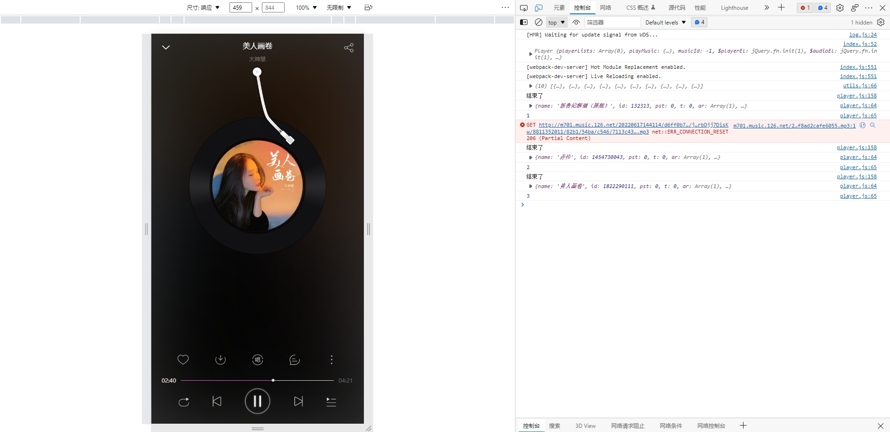

# 使用说明

- 这是一个简单的网易云H5播放器，目前只有播放，切换歌曲，循环模式等功能，歌曲列表暂时还没有开发，我想做的事情有很多，但我的能力和时间是有限的。

- 项目采用的技术栈是 `H5 + CSS3`,`jQuery`,`webpack`,它运用了 `vw + rem` 适配移动端浏览器,它应用了 H5 和 CSS3 的新特性。

## 接口文档

- 请把接口文档中的 `127.0.0.1:3000` 换成 `tools.wgudu.com:3000` 即可访问。
- 文档地址：[https://console-docs.apipost.cn/preview/1d639e41528dc6c3/34ca9e82bc17bd23](https://console-docs.apipost.cn/preview/1d639e41528dc6c3/34ca9e82bc17bd23)

## 启动项目

- 执行 `npm install` 安装包依赖

- 执行 `npm run dev` 命令进入开发模式

## 展示

